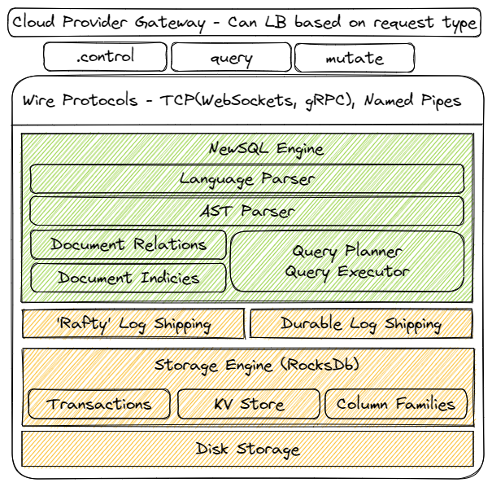

# Architecture

# Feature List v1
* (p0.2) Interface: Wire Protocol - http
* (p0.1) Engine: Language Parser (SQLish)
* (p0.0) Engine: Query Planner & Executor
* Storage: [*] Txn
* Storage: [*] KV Store
* Storage: [*] Index Support - (Column Families)
* Storage: [] Backups (Checkpoints)

# References
https://github.com/wspeirs/btree
https://yetanotherdevblog.com/bloom-filters/
https://yetanotherdevblog.com/dense-vs-sparse-indexes/
https://yetanotherdevblog.com/lsm/

# Current
So ... it seems RocksDb is a great fit for starting point as it provides transactions and a fantastic
database model to start. It uses Bloom Filters, LSM's, transactions, pluggable architecture, etc. This
will be a great starting point as it takes a lot of the initial storage guesswork out. For now - there
will need to be a few things required:
- Execution Planner
  - This will need indexing later but MUST support scanning.
- Query Language (I would like to use something similar to Kusto Query Language if Possible)
- MongoDb would be interesting...
- Choose data storage type. BSON is interesting but what else is there?
- BSON Spec is OpenSource ... so BSON it is!
